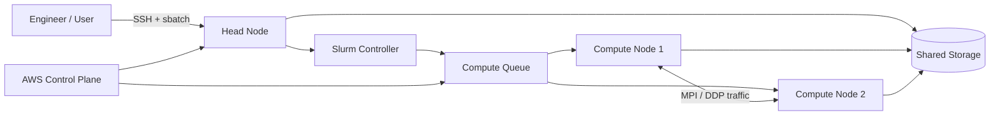

# AWS Mini Supercomputer

[](https://github.com/wahdatullah70/aws-mini-supercomputer/actions/workflows/ci.yml)
[](LICENSE)

A reproducible **Slurm-based HPC lab on AWS** for learning and demonstrating distributed computing, MPI, PyTorch Distributed Data Parallel, scheduling, benchmarking, troubleshooting, security, and cloud cost awareness.

> This repository is designed as a portfolio-grade infrastructure project: the focus is not only on creating resources, but on documenting how the system is built, operated, validated, measured, secured, and torn down.

## Architecture



### Main components

- **AWS ParallelCluster** — cluster lifecycle and infrastructure orchestration
- **Slurm** — scheduler and resource manager
- **Head node** — login, job submission, scheduler control
- **Compute nodes** — autoscaled workload execution
- **Shared storage** — common data/workspace path
- **MPI** — real multi-process Pi integration benchmark in C with `MPI_Reduce`
- **PyTorch DDP** — distributed machine-learning example

## End-to-end workflow

```text
Configure infrastructure
        │
        ▼
Validate ParallelCluster config
        │
        ▼
Provision AWS resources
        │
        ▼
SSH to head node
        │
        ▼
Check Slurm / node health
        │
        ▼
Submit MPI or DDP job
        │
        ▼
Slurm allocates compute nodes
        │
        ▼
Workload executes
        │
        ▼
Collect logs + benchmark evidence
        │
        ▼
Troubleshoot / compare results
        │
        ▼
Delete cloud resources
```

## Demo evidence

Because the original AWS runtime evidence is not preserved in this public repository, the project includes a clearly labeled **synthetic evidence pack** showing the expected operational workflow without pretending the numbers were measured on a live cluster:

- [Synthetic Slurm/AWS terminal session](results/demo-terminal-session.md)
- [Benchmark-results template](results/demo-benchmarks.csv)
- [Evidence collection guide](results/README.md)

> Anything marked `SYNTHETIC`, `DEMO`, or `<MEASURED_AT_RUNTIME>` is illustrative only. Real timing, throughput, speedup, and efficiency values must come from an actual cluster run.

## CI validation

GitHub Actions automatically checks:

- Python syntax for benchmark code;
- shell-script syntax;
- YAML parsing for infrastructure configuration.

This catches repository-level errors without pretending to provision AWS resources inside CI.

## Repository structure

```text
aws-mini-supercomputer/
├── .github/workflows/ci.yml
├── README.md
├── LICENSE
├── SECURITY.md
├── CONTRIBUTING.md
├── docs/
│   ├── architecture.md
│   ├── setup-aws.md
│   ├── parallel-compute.md
│   ├── distributed-ml.md
│   ├── benchmarking.md
│   ├── security.md
│   ├── troubleshooting.md
│   └── cost-control.md
├── infra/
│   └── pcluster/
│       └── cluster-config.example.yaml
├── results/
│   ├── README.md
│   ├── demo-terminal-session.md
│   └── demo-benchmarks.csv
└── scripts/
    └── benchmarks/
        ├── mpi_pi.c
        ├── mpi_pi.sh
        ├── run_mpi.sh
        ├── pytorch_ddp.py
        └── run_ddp.sh
```

## Quick start

### 1. Understand the design

Read [docs/architecture.md](docs/architecture.md).

### 2. Configure and provision

Follow [docs/setup-aws.md](docs/setup-aws.md) and start from:

```text
infra/pcluster/cluster-config.example.yaml
```

### 3. Validate Slurm

```bash
sinfo
squeue
scontrol show partition
```

### 4. Run parallel workloads

Local MPI smoke test:

```bash
NP=4 STEPS=10000000 bash scripts/benchmarks/mpi_pi.sh
```

Slurm MPI run:

```bash
sbatch scripts/benchmarks/run_mpi.sh
```

PyTorch DDP:

```bash
sbatch scripts/benchmarks/run_ddp.sh
```

### 5. Measure and document

Use [docs/benchmarking.md](docs/benchmarking.md) and [results/README.md](results/README.md) to capture environment, timing, throughput, speedup, efficiency, logs, and limitations.

### 6. Tear down

```bash
pcluster delete-cluster --cluster-name mini-hpc
```

Always verify that no unnecessary supporting resources remain in the AWS account.

## Engineering documentation

| Topic | Guide |
|---|---|
| Architecture | [docs/architecture.md](docs/architecture.md) |
| AWS setup | [docs/setup-aws.md](docs/setup-aws.md) |
| MPI flow | [docs/parallel-compute.md](docs/parallel-compute.md) |
| Distributed ML | [docs/distributed-ml.md](docs/distributed-ml.md) |
| Benchmarking | [docs/benchmarking.md](docs/benchmarking.md) |
| Security | [docs/security.md](docs/security.md) |
| Troubleshooting | [docs/troubleshooting.md](docs/troubleshooting.md) |
| Cost control | [docs/cost-control.md](docs/cost-control.md) |
| Results/evidence format | [results/README.md](results/README.md) |
| Contribution workflow | [CONTRIBUTING.md](CONTRIBUTING.md) |
| Security policy | [SECURITY.md](SECURITY.md) |

## What this project demonstrates

- HPC architecture and scheduler concepts
- Slurm job submission and troubleshooting
- real MPI parallelism using `MPI_Reduce`
- Linux cluster operations
- MPI and distributed ML workflows
- AWS infrastructure provisioning
- CI-based repository validation
- performance measurement and evidence collection
- security boundaries and credential hygiene
- cost-aware cloud operations
- technical documentation suitable for engineering handoff

## Safety / cost note

The example infrastructure configuration is intentionally small, but AWS resources can still incur charges. Review current AWS pricing and quotas before provisioning, use least-privilege credentials, never commit secrets, and delete resources when experiments are complete.

## Author

**Wahdat Ullah** — HPC, Linux Systems, Cloud, DevOps, Kubernetes, Security & MLOps

[GitHub Profile](https://github.com/wahdatullah70) · [Engineering Portfolio](https://github.com/wahdatullah70/My_Protfolio)
